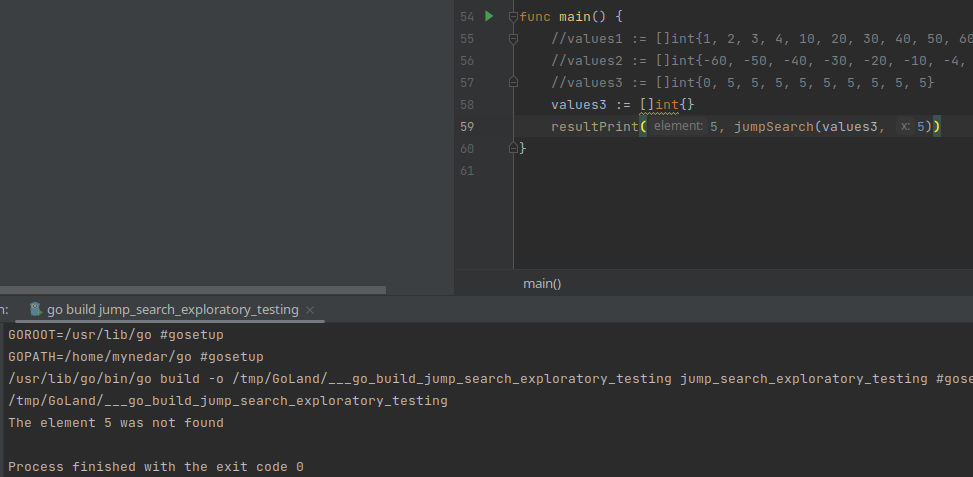

## Exploratory testing of Jump search algorithm

# 1. észrevétel
Az `jumpSearch` függvény egy int tömböt vár és egy int értéket, amit meg szeretnénk találni a tömbben.
Ez akkor látszik, amikor meg szeretnénk hívni a függvényt és csak akkor fut le, ha a megfelelő adatokat adjuk meg.
Ha mással próbálkozunk, mint például stringekkel, akkor hibát fog jelezni a fejlesztői környezet is.

# 2. észrevétel
Rendezetlen lista esetén nem ad megfelelő eredményeket az algoritmus:

Mint látható, nem találja meg az algoritmus a 89-es számot, annak ellenére sem, hogy az a lista elején található.
Hasonlóan nem találja meg a 2-es számot, ami pedig a lista végén található.
Valószínűleg az algoritmus rendezett tömböt vár bemenetnek.

# 3. észrevétel
Csökkenő sorrendbe rendezett tömb esetében egyáltalán nem működik az algoritmus, nem találja meg egyik számot sem:

# 4. észrevétel
Növekvő sorrendbe rendezett tömb esetében minden teljesen jól működik.
Ezek szerint az algoritmus növekvőbe rendezett int tömböket vár bemenetnek.

# 5. észrevétel
Növekvő sorrendbe rendezett csupa negatív intek tömbjénél is minden a legnagyobb rendben működik. 
Ezek szerint az algoritmusnak nem okoz gondot  anegatív számok kezelése. 
Úgy látszik csak az számít, hogy növekvő sorrendben legyenek az elemek.

# 6. észrevétel
Csupa ugyan olyan értékekkel feltöltött tömb esetén a megtalált elem mindig a 0-ás indexen lévő elem.

# 7. észrevétel
Két különböző értékekkel feltöltött tömb esetén a megtalált elem(Ha az mindig a nagyobb szám) 
mindig a lehető legkisebb indexen lévő keresett elem.

# 8. észrevétel
Üres tömb esetén is teljesen jól működik az algoritmus.

1 elemű tömb esetén is működik az algoritmus.

# 9. észrevétel
1 elemű tömb esetén is működik az algoritmus.

# Összefoglalás
Az exploratory teszting lényege, nem is feltétlen az,
hogy teljesen le legyen tesztelve egy osztály, funkció vagy fügvény, hanem az,
hogy segítse a megértését annak, amit tesztelünk,
jobb belelátást adjon a tesztelő számára. 
Ezekkel a tapasztalatokkal, már sokkal könnyebben lehet elkezdeni dolgozni a tesztelt eszközökkel.
Jelen esetben sokkal mélyebben meg lehetett érteni az algoritmus működését és azt, hogy hogyan is érdemes azt használni.
Mindezek mellet az is előnyös az ilyen tesztelésnél, hogy sokkal jobban megjegyzi a tesztelő azt,
hogy hogyan használja ezeket az eszközöket és, hogy mire érdemes oda figyelni.