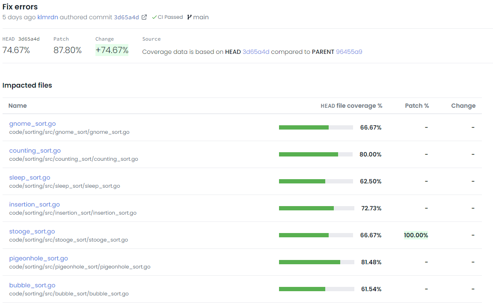
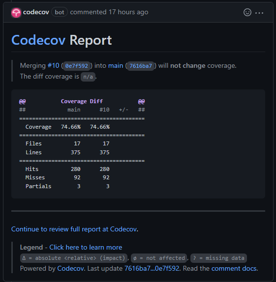

# Egységtesztek készítése és tesztek kódlefedettségének mérése

## Egységtesztek készítése

A kódbázisban sok nyelven implementált algoritmus található,
a feladat megoldása során a Go nyelven implementált kereső
és rendező algoritmusokhoz lettek egységtesztek létrehozva.

Az egységtesztek megírásához a Go beépített tesztrendszerét
használtuk. A tesztek a tesztelendő fálj nevével és a  `_test`
utótaggal ellátott fáljokban találhatóak. A teszteket
a `go test` parancsal tudjuk futtatni.

A futtatás kimenete a következőhöz hasonló:

```
=== RUN   TestBogoSort
--- PASS: TestBogoSort (0.00s)
PASS
coverage: 72.7% of statements
ok  	command-line-arguments	0.415s	coverage: 72.7% of statements
=== RUN   TestBubbleSort
--- PASS: TestBubbleSort (0.00s)
PASS
coverage: 63.6% of statements
ok  	command-line-arguments	0.383s	coverage: 63.6% of statements
=== RUN   TestBucketSort
--- PASS: TestBucketSort (0.00s)
PASS
coverage: 81.1% of statements
...
```

### A rendezések tesztelése és javítása

A rendezések tesztelése során több bemenettet is kipróbálunk, többek
között rendezetlen, rendezett és üres bemenetet. A `float64` számok
kezelő algoritmusoknál `NaN` számot tartalmazó bemenet is tesztelve van.

A tesztek több hibát is találtunk, melyek kijavításra kerültek. A hibák
a lgetöbb esetben az üres bemenet nem kezelése volt.

Volt olyan eset egy `float64` is kezelő algoritmusnál, ahol a `NaN`
számot tartalmazó esetben volt hiba, az algorimtus rosszul számolta a
cél indexet és buffer overflow hibát kaptunk.

### A keresések tesztelése és javítása

A keresések tesztelése során a teszt bemenet két csoportba osztható,
amikor olyan számot keresün, ami megtalálható vagy nem a tárolóban.

Hiba volt a bináris keresést implementáló algoritmusban, az aktuálisan
olvasott adat alapján rossz irányba haladt tovább a függvény és semilyen
értéket nem talált meg.

Ezen kívül még az interpolation keresés okozott meglepetést, ahol
a nem létező értékek is kaptak index értéket az elvárt működés alapján.
Ebben az esetben a teszt lett módosítva, hogy a specifikációt kövessük.

## Tesztek kódlefedettségének mérése

A Go tesztrendszere beépítetten tartalmaz kód lefedettség
mérésére lehetőséget, amit a `go test -cover` tudunk elérni.

Viszont a feladat megoldása során a **Codecov** platform által
nyújtott szolgáltatást vettük igénybe.
Ahhoz, hogy a **Codecov** platform lefedettségi információt
tudjon nyújtani a `go test -coverprofile=profile.out -covermode=atomic`
parancsal kell futtatni a teszteket. A *coverprofile* a CI rendszer egyik
lépésében feltöltésre kerül a platformra - a
`bash <(curl -s https://codecov.io/bash)` parancsal -,
ahol amikor fel lesz dolgozva megjelenik a lefedettségi információ.



A **Codecov** platform a jelentéseken kivül a Github pull-request
rendszerébe is beépül és a változtatások után rövid jelentést készít
egy kommentben.


